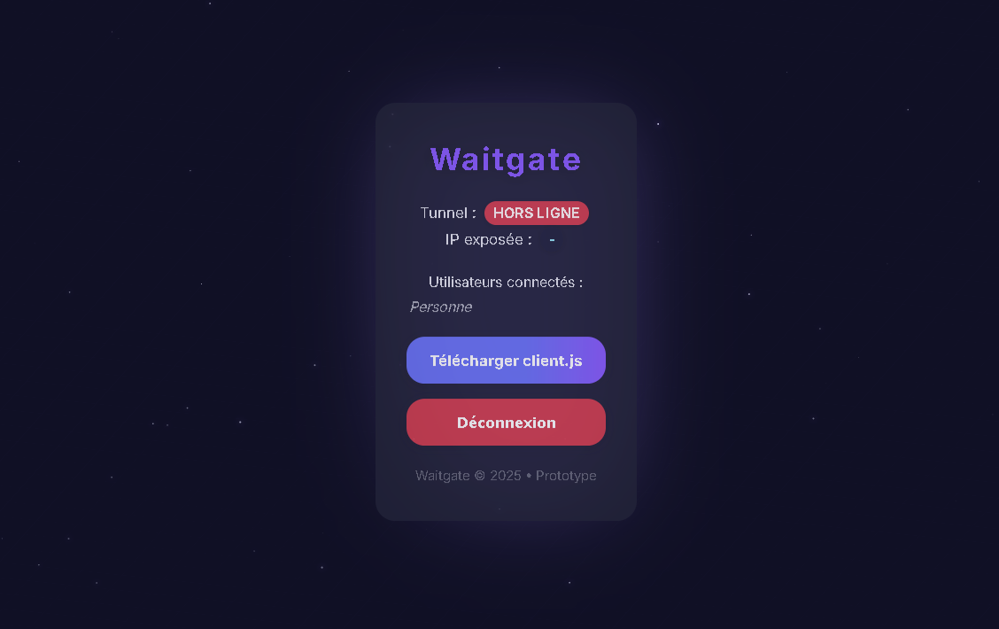

<p align="center">
    
</p>

<h1 align="center">
    <strong>Waitgate</strong>
</h1>

---

<p align="center">
    🔁 Self-hosted reverse proxy tunnel for securely exposing HTTP and TCP services.
</p>

<p align="center">
    <a href="https://github.com/Nullmess/Waitgate/stargazers">
        
    </a>
    <a href="LICENSE">
        
    </a>
    
    <a href="https://waitgate.onrender.com/">
        
    </a>
</p>

<p align="center">
    <a href="https://waitgate.onrender.com/">
        
    </a>
</p>

---

## ✨ Features

* Expose HTTP, HTTPS and raw TCP services such as SSH or RDP
* Outbound WebSocket tunnel with no inbound port required on the target machine
* ChaCha20-Poly1305 encryption for raw TCP tunnel payloads
* Token-authenticated tunnel connections
* Dashboard authentication with optional TOTP 2FA
* Rate limiting and temporary blocking against abusive requests
* Single public port shared by HTTP and raw TCP traffic
* Dashboard-generated `client.js` with automatic WS/WSS endpoint configuration
* Real-time tunnel status and connected client information
* Fully self-hosted and open source

---

## 🚀 Usage

Clone the repository and install dependencies:

```shell
git clone https://github.com/Nullmess/Waitgate.git
cd Waitgate
npm install
```

Start Waitgate:

```shell
npm start
```

Open the dashboard:

```text
http://localhost:8000/dashboard
```

The default username is `admin`. A random dashboard password, tunnel token and encryption key are generated on first launch and stored in `.env`.

From the dashboard, download `client.js`, then configure the local service to expose:

```js
const LOCAL_HOST = '127.0.0.1'
const LOCAL_PORT = 443
```

Run the tunnel client on the target machine:

```shell
node client.js
```

Waitgate automatically reconnects the client when the WebSocket tunnel is interrupted.

---

## ⚙️ Configuration

Waitgate creates and maintains its local `.env` configuration automatically.

Main variables:

```text
TUNNEL_CHACHA_KEY   ChaCha20-Poly1305 key used for raw TCP tunnel payloads
TUNNEL_TOKEN        Bearer token used to authenticate the tunnel client
DASH_USER           Dashboard username
DASH_PASS           Dashboard pasWaitgate is intended for administration, development and authorized remote access to systems you own or have permission to manage.

Users are responsible for complying with applicable laws, network policies and service terms. The authors are not responsible for misuse or damage caused by the software.sword
LOGIN_SECRET        Key used to protect dashboard login data
TOTP_ENABLED        Enables or disables dashboard TOTP authentication
TOTP_SECRET         TOTP secret when 2FA is enabled
WHITELIST_IPS       IP addresses excluded from rate limiting
PORT                Public listening port, defaults to 8000
```

---

## 🔐 Security

Waitgate secures raw TCP tunnels with ChaCha20-Poly1305 encryption, token authentication and optional TOTP 2FA, while HTTPS/WSS is recommended for HTTP traffic.

---

## ⚠️ Disclaimer

Waitgate is intended for legitimate and authorized use only; users are responsible for ensuring that their use of the software complies with applicable laws, policies and permissions.

---

## 👤 Author

Give a ⭐️ if Waitgate helped you!

---

## 📄 License

Copyright © 2026 [Nullmess](https://github.com/Nullmess).<br />
This project is licensed under the [MIT License](LICENSE).
